## 功能介绍 

   会议室小程序：是为企业、园区、学校等机构打造的轻量化会议室管理平台，旨在提升场地使用效率、优化会议组织体验，实现线上线下服务闭环。它既为用户提供便捷的信息获取、会议室预约、个人中心管理等功能，也为管理员提供高效的内容维护、预约管理、用户管理及数据导出等后台能力。对用户：信息获取更及时，场地预约更便捷，会议组织更高效。对机构：场地管理更规范，数据统计更精准，运营成本更可控。
 

## 技术运用
- 前端基于微信小程序平台进行开发
- 后端基于Java Springboot架构开发
- 数据库： MySQL (8.0+) 

## 演示 
 

## 安装

- 安装手册见源码包里的word文档 

## 截图

 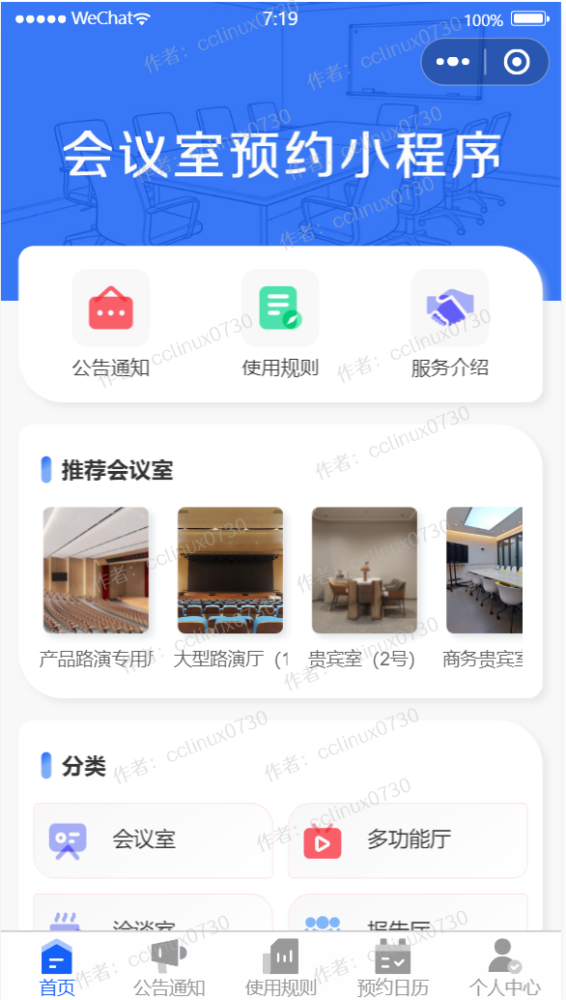
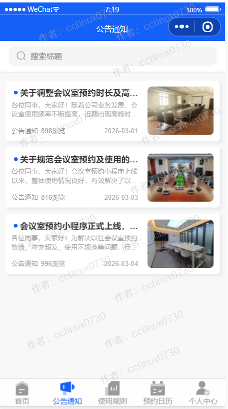

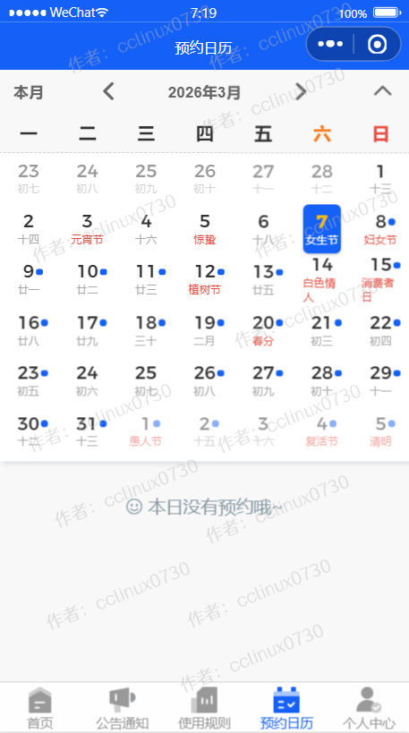

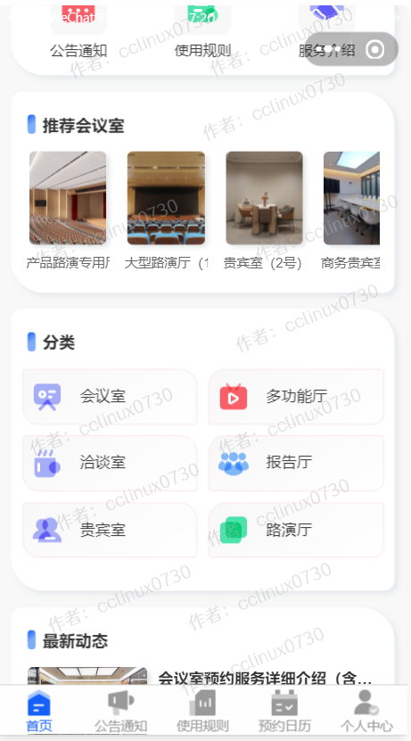
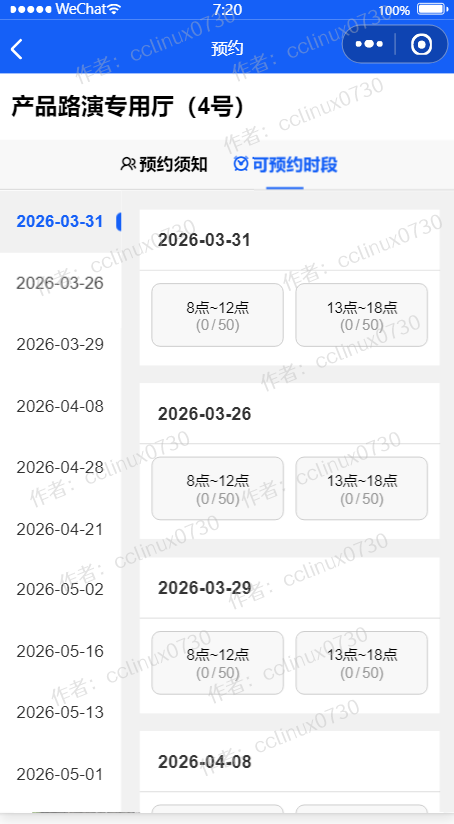
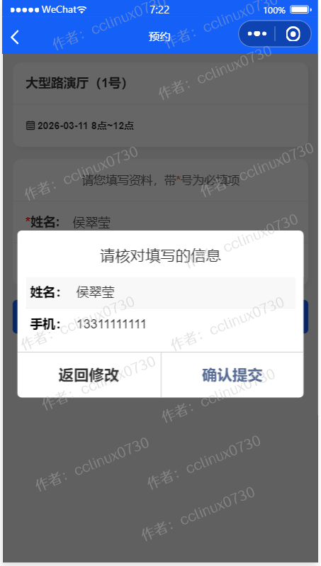
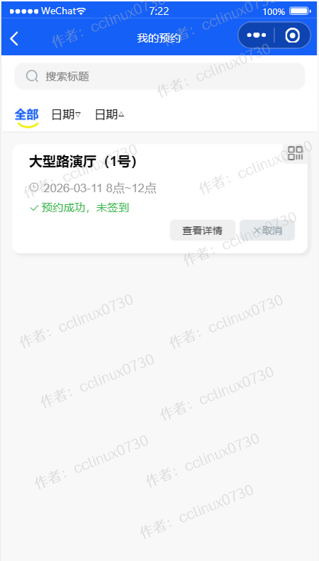

## 后台管理系统截图 
- 后台超级管理员默认账号:admin，密码123456，请登录后台后及时修改密码和创建普通管理员。

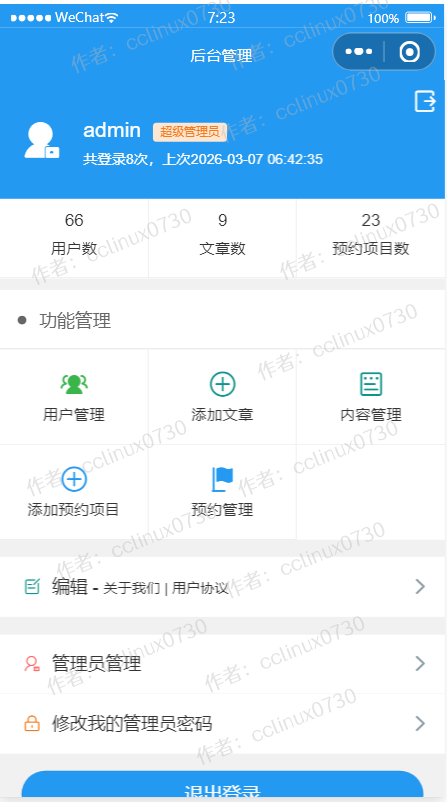

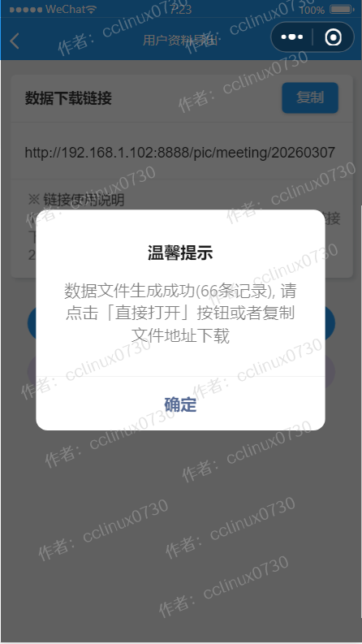

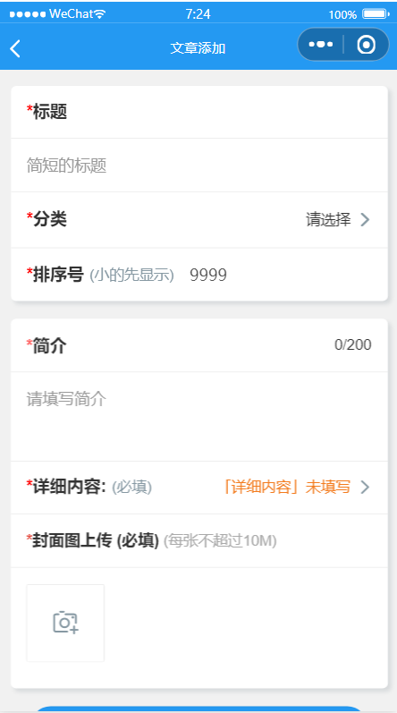
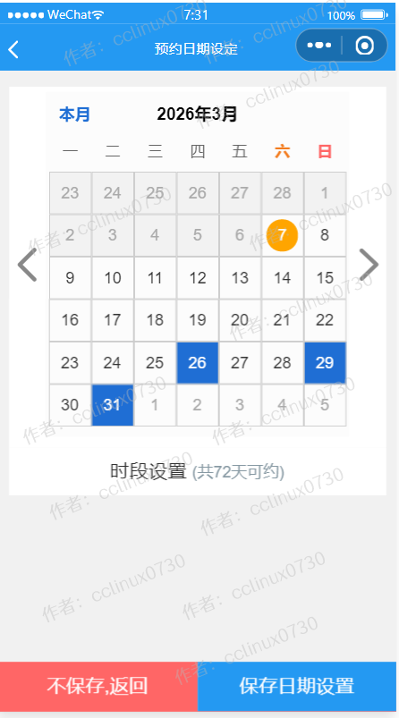

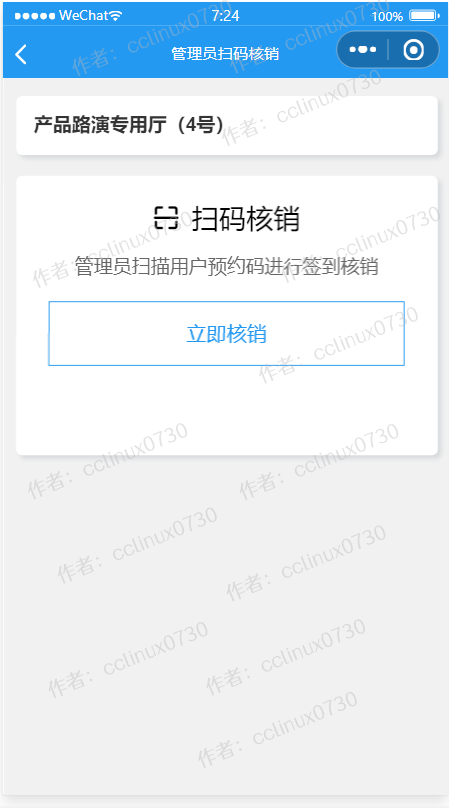
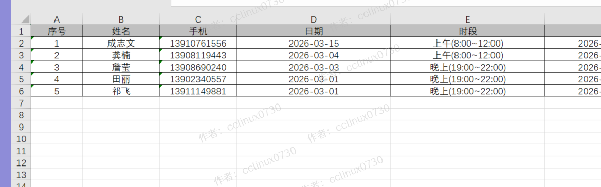

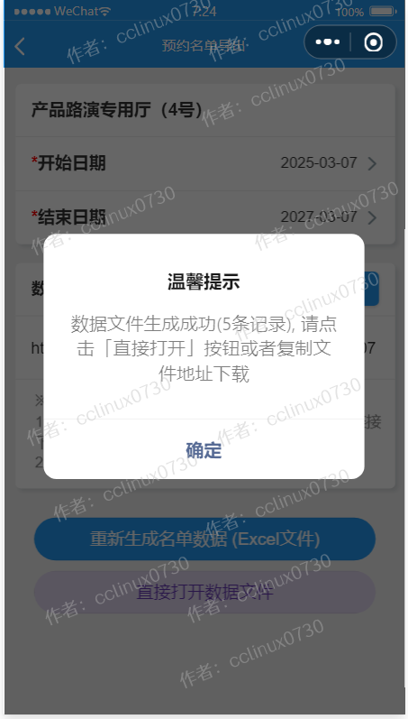
 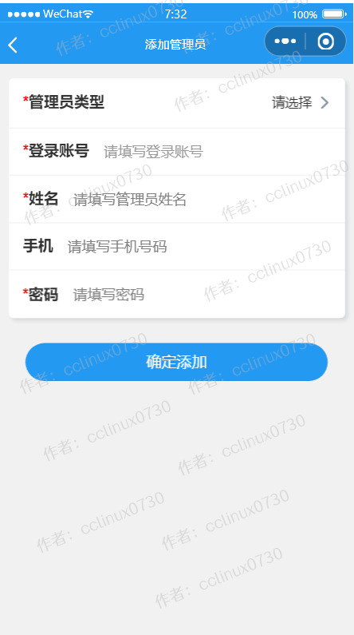